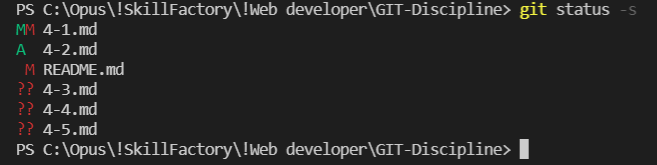

[<<-](./3-1.md) ---
[-<-](./3-4.md) ---
[СОДЕРЖАНИЕ](./README.md) ---
[->-](./4-2.md) ---
[->>](./5-1.md)

---

# **4. Управление**
## *1. Как проверить статус файлов?*
Чтобы проверить статус файлов, используется комманда `git status`, с помощью которой можно узнать в каком статусе файл:
  + `Untracked` = файл не индексирован
  + `Unmodified` = файл индексирован, но не изменен
  + `Modified` = файл индексирован и изменен
  + `Staged` = идексированный файл готов к коммиту

Чтобы просмотреть в упрощенном виде статус файлов, используется опция `-s` или `--short`:
```
git status -s
```
<br>

На экран выводится два столбца со следующим условными обозначениями:
<table>
    <tr>
        <th>Символ слева</th>
        <th>Символ справа</th>
        <th>Статус</th>
    </tr>
    <tr>
        <td>?</td>
        <td>?</td>
        <td>не идексирован</td>
    </tr>
    <tr>
        <td>A</td>
        <td>-</td>
        <td>индексирован</td>
    </tr>
    <tr>
        <td>M</td>
        <td>-</td>
        <td>модифицирован</td>
    <tr>
        <td>-</td>
        <td>М</td>
        <td>модифицирован, но не индексирован</td>
    </tr>
    </tr>
    <tr>
        <td>M</td>
        <td>М</td>
        <td>модифицирован, индексирован и снова модифицирован</td>
    </tr>
</table>

---

Вот как это будет выглядеть в консоли Windows PowerShell VS Code:



Чтобы узнать более подробно об изменениях файлов и их статутуса, используется комманда `git diff`.

Чтобы узнать о том, какие файлы проиндексированы и войдут в следующий коммиит, используется опция `--staged` или `--cached`:
```
git diff --staged
git diff --cached
```

---